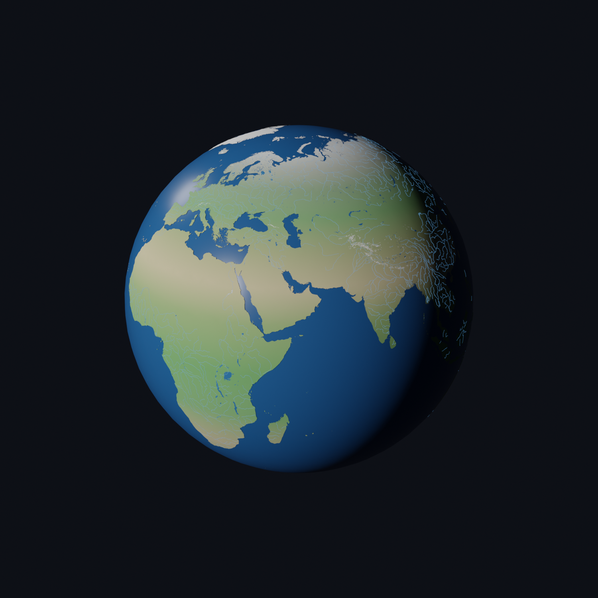

# WGS 84 Globe — Blender + Natural Earth

A geographically accurate 3D Earth built in Blender and driven programmatically
through the [blender-mcp](https://github.com/ahujasid/blender-mcp) server. The
globe is a true **WGS 84 ellipsoid** (EPSG:4326 datum) with real vector data
from [Natural Earth](https://www.naturalearthdata.com/) draped onto its surface,
lit by a physically-placed sun.



---

## Quick start

Requires **Blender 5.1** (tested) and **[uv](https://docs.astral.sh/uv/)**.

```bash
git clone https://github.com/kartographia/blender-globe.git
cd blender-globe
uv sync                              # Python 3.13 venv with the GIS toolkit
./scripts/fetch_data.sh              # download Natural Earth layers into Data/

# triangulate the polygon layers (→ Data/*.npz)
uv run python scripts/build_land_mesh.py
for l in ne_10m_lakes ne_10m_glaciated_areas ne_10m_antarctic_ice_shelves_polys; do
  uv run python scripts/build_land_mesh.py Data/$l/$l.shp Data/$l.npz 1.0
done

# build the scene + render headlessly (macOS path shown; use your blender binary)
/Applications/Blender.app/Contents/MacOS/Blender -b --factory-startup \
  --python scripts/build_all.py -- --save
```

Output: `renders/globe_render.png` and `Globe.blend`. To build interactively
via [blender-mcp](https://github.com/ahujasid/blender-mcp) instead, step through
**[RECIPE.md](RECIPE.md)**.

---

## What's in the scene

| Object | Source layer | Representation |
|--------|--------------|----------------|
| **Globe** | — | WGS 84 ellipsoid (oblate), ocean-blue surface |
| **Land** | `ne_10m_land` | Triangulated fill, per-vertex latitude/climate colors |
| **Lakes** | `ne_10m_lakes` | Triangulated blue fill |
| **Rivers** | `ne_10m_rivers_lake_centerlines` | Blue beveled-curve lines |
| **Glaciers** | `ne_10m_glaciated_areas` | White fill (Greenland, Arctic, alpine) |
| **IceShelves** | `ne_10m_antarctic_ice_shelves_polys` | White fill around Antarctica |
| **Oceans** | `ne_10m_ocean` | Coastline reference curves *(hidden in render)* |
| **Equator / PrimeMeridian** | — | Reference bands *(hidden in render)* |
| **Sun** | computed | Directional light aimed at the subsolar point |
| **GlobeCam** | — | Framed render camera |

---

## Key design decisions

- **Ellipsoid, not a sphere.** A UV sphere is scaled to WGS 84 axes
  (a = 6,378,137 m, b = 6,356,752 m, 1/f = 298.257223563) and the scale is
  *applied* to the mesh, so the geometry is a genuine oblate ellipsoid.
- **Scale: 1 Blender unit = 1000 km.** So a ≈ 6.378 units, b ≈ 6.357 units.
  Earth centered at the world origin (0, 0, 0).
- **Orientation:** lon 0° (Greenwich) → **+X**, lon 90° E → **+Y**, North Pole → **+Z**.
- **Exact geodetic → ECEF mapping.** Vector data is placed with the full
  geodetic formula (prime-vertical radius `N`, eccentricity `e²`), landing every
  point precisely on the ellipsoid surface — not a naive spherical projection.
- **Layers are stacked by a tiny radial offset** so higher layers win visually:
  `ocean 0 < coastlines 0.006 < land 0.010 < lakes 0.012 < rivers 0.013 < glaciers/shelves 0.016`.
- **Physically-placed sun.** The sun is aimed at the real **subsolar point**
  (sun-overhead lat/lon) for a chosen UTC instant, so the correct hemisphere is
  lit and the day/night terminator is an accurate great circle. Solar
  declination provides the seasonal tilt, so no separate axial tilt is applied.

---

## Two-interpreter architecture

There are **two** Python environments, by necessity:

1. **Project venv** (`.venv`, Python 3.13, managed by [uv](https://docs.astral.sh/uv/)) —
   heavyweight GIS libraries (`pyshp`, `pyproj`, `shapely`, `triangle`) used to
   **preprocess** shapefiles (read, repair, triangulate) *outside* Blender.
2. **Blender's bundled Python** (3.13) — runs the scene-building code via the MCP
   `execute_blender_code` tool. It cannot use the venv's compiled libraries, so
   `pyshp` is **vendored** as a single pure-Python file at `vendor/shapefile.py`,
   and heavy preprocessing hands Blender clean intermediate data (`.npz` meshes).

```
shapefile (.shp, EPSG:4326)
      │  venv: pyshp + shapely + triangle
      ▼
triangulated mesh (.npz: lon/lat verts + faces)
      │  Blender: numpy maps lon/lat → ECEF, builds mesh
      ▼
geometry draped on the ellipsoid + materials
```

---

## Project layout

```
blender-globe/
├── README.md                  # this file
├── RECIPE.md                  # step-by-step recreation guide
├── pyproject.toml / uv.lock   # uv project (pyshp, pyproj, shapely, triangle)
├── .python-version            # pins Python 3.13 (matches Blender)
├── vendor/
│   ├── shapefile.py           # vendored pyshp, importable inside Blender
│   └── LICENSE-pyshp.txt
├── scripts/
│   ├── fetch_data.sh          # (shell)   download Natural Earth layers → Data/
│   ├── build_land_mesh.py     # (venv)    triangulate a polygon shapefile → .npz
│   ├── build_all.py           # (Blender) run every Blender step below in order
│   ├── create_globe.py        # (Blender) WGS 84 ellipsoid + reference bands
│   ├── shapefile_to_globe.py  # (Blender) drape lines/polygons as beveled curves
│   ├── fill_land_ocean.py     # (Blender) ocean material + climate-colored land
│   ├── add_polygon_layers.py  # (Blender) lakes / glaciers / ice shelves fills
│   ├── add_rivers.py          # (Blender) rivers + lake centerlines
│   └── render_globe.py        # (Blender) subsolar sun + camera + render
└── renders/
    └── globe_render.png
```

Not committed (see `.gitignore`), all regenerable: `.venv/`, `Data/`
(downloads + `.npz` caches), and `*.blend` scenes.

Scripts locate the project root from their own path, so the repo can live
anywhere. Override with the `GLOBE_PROJECT` environment variable if needed.

---

## Tooling

- **Blender 5.1** (tested), optionally with the blender-mcp add-on
  (socket on `127.0.0.1:9876`) for interactive, AI-driven building.
- **uv** for the project venv and Python pin.
- **Natural Earth 1:10m** vector layers.

## Credits & licenses

- Map data: [Natural Earth](https://www.naturalearthdata.com/), public domain.
- `vendor/shapefile.py`: [pyshp](https://github.com/GeospatialPython/pyshp),
  MIT License (see `vendor/LICENSE-pyshp.txt`).

See **[RECIPE.md](RECIPE.md)** to rebuild the whole thing from scratch.
